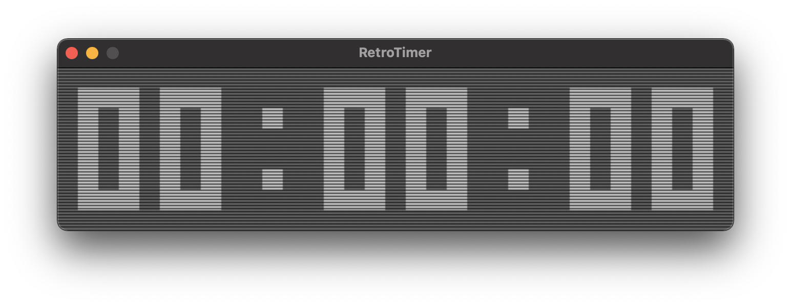

# RetroTimer

A basic timer with retro aesthetic for casual streaming, written in C with SDL2. Not recommended for speedrunning. 

*Screenshot of RetroTimer running*

It keeps good time with no long- or short-term drifting, and it is fairly CPU efficient. This is achieved through only checking the system clock every 10 ms, or 100 times per second, and only updating the display when the time has changed. Higher delay values may make it more efficient, but you may notice more short-term drift. The timer will overflow if left running for 49 days due to SDL2 limitations.

*Screenshot of RetroTimer paused*

# Controls

Buttons:
-

- Space: start/stop timer
- Q/W: subtract/add hours
- A/S: subtract/add minutes
- Z/X: subtract/add seconds

Command Line Options:
-

Specify hh mm ss on the command line to start with an initial time, for example:

    ./timer 01 42 02
    ./timer 1 42 2

Both of these options will start the timer with the clock set at 01:42:02.

# Compiling and Running

A C compiler and SDL2 libraries (https://www.libsdl.org/download-2.0.php) are required. There is a basic `Makefile` included that may work for you. Check the SDL2 website for instructions if the `Makefile` doesn’t work.

MacOS app & streaming with OBS
-

If you compile at the command line and rename the executable RetroTimer.app, it will be launched without opening a terminal window. Feel free to move it into `/Applications` for access from Launchpad.

**If you plan on using this for streaming or recording with OBS, you will probably need to use cropped desktop capture, because window capture in OBS is very laggy!** This is not a bug with RetroTimer, but an issue with the window capture feature of OBS.

License
-

See `LICENSE.md` for terms and conditions.