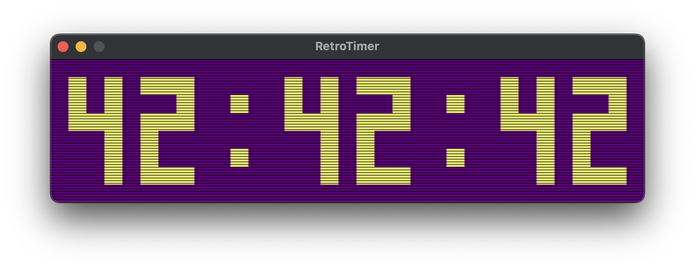

# RetroTimer

A basic timer with retro aesthetic for casual streaming, written in C with SDL2. Not recommended for speedrunning. 

It seems to keep good time with no long- or short-term drifting and not too CPU intensive, but I’ll probably continue to work on optimizing it and cleaning up the code.

# Controls

Buttons:
-

- Space: start/stop timer
- Q/W: subtract/add hours
- A/S: subtract/add minutes
- Z/X: subtract/add seconds

Command Line Options:
-

Specify hh mm ss on the command line to start with an initial time, for example:

    ./timer 01 42 02
    ./timer 1 42 2

Both of these options will start the timer with the clock set at 01:42:02.

# Compiling and Running

A C compiler and SDL2 libraries (https://www.libsdl.org/download-2.0.php) are required. There is a basic `Makefile` included that may work for you. Check the SDL2 website for instructions if the `Makefile` doesn’t work.

MacOS app
-

If you compile at the command line and rename the executable RetroTimer.app, it will be launched from /Applications without opening a terminal window. I may release an Xcode-compiled binary in the future.
